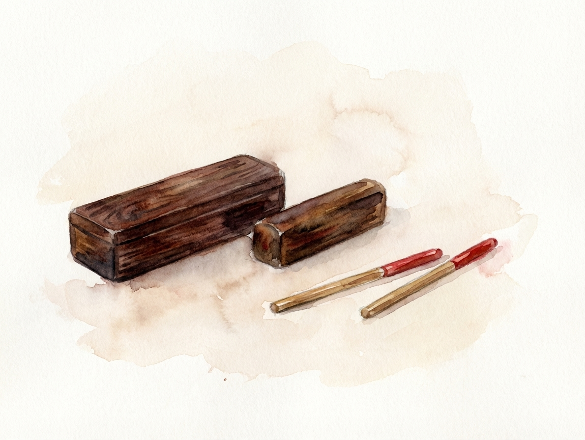

今天想和大家分享我最新完成的水彩插畫作品——北管器物中的「扣仔」（又稱打扣、扣仔盞）。

## 關於北管「扣仔」的造型考究

在繪製這幅作品時，我特別參考了網路上可以查照到的北管扣仔實體。扣仔通常由一對精緻的小銅鈴或小鈸組成，中間以細繩串接。為了確保造型的正確性，我仔細琢磨了它金屬邊緣的厚度，以及敲擊面微微隆起的弧度比例。

## 水彩風格的詮釋

為了呈現水彩插畫特有的溫潤質感：
1. **去蕪存菁**：在繪製前我確保畫面乾淨，不添加任何干擾的浮水印。
2. **忠於構圖**：嚴格貼合實物的構圖與比例，不做多餘的誇張變形。
3. **渲染光澤**：利用水彩乾濕重疊的技法，表現出黃銅在光線照射下的溫潤金屬光澤。

以下是完成的作品展示：

  <!-- 🔴 關鍵：Markdown 內文引用同樣直接填寫檔名即可！ -->

希望透過這樣的手繪風格，能讓更多人注意到台灣傳統北管器物的精緻與美感。
